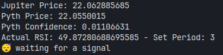

####  Solana Hyperdrive Hackaton Entry


# Latent Token Robot

This is a Rust program that implements a basic technical analysis trading bot. It monitors the price of SOL on Jupiter and Pyth oracles and generates buy/sell signals based on the confidence level of a the pyth oracle plus a simple RSI strategy.




## Key Libraries

The following crates enable key functionality: 

- `solana-client` - Interact with Solana cluster
- `pyth-sdk-solana` - Access Pyth on-chain price feed
- `ta` - Technical analysis indicators
- `reqwest` - HTTP client for Jupiter API   
- `serde` - Serialization for custom data types
- `tokio` - Async runtime for Jupiter request

## Architecture

The bot follows a modular architecture:

- **Strategy** - Defines trading parameters
- **Signal** - Generates signals from indicators  
- **Trader** - Runs main loop, gets data, updates indicators, handles signals
- **Jupiter** - Fetches SOL price from Jupiter API
- **Pyth** - Gets SOL price/confidence from on-chain feed

## Roadmap

- Decentralize more by hosting in the Akash network or another cloud computing blockchain
- Make a transaction with a instruction to invoke the cloud server and start the bot
- Make an UI to start and follow the progress of the bot
- Make strategies pools and serve on month to month basis
- Print an nft with the results at the end of the strategy

## Usage

To run the bot:

```
cargo run
``` 

This starts the main loop, printing prices, indicators, and generated signals each cycle.

</br>
